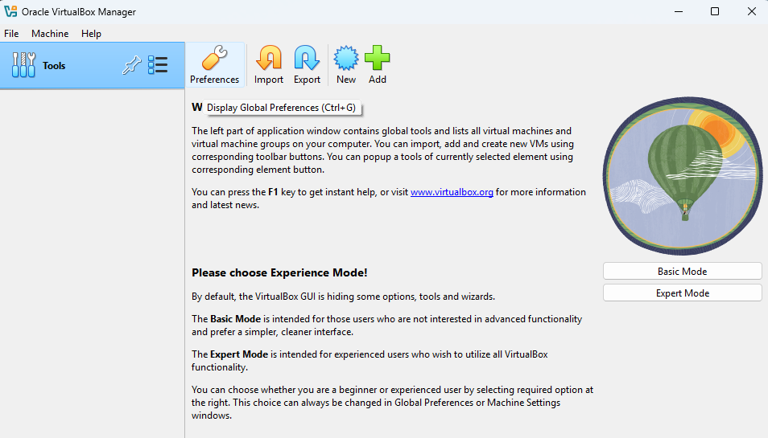

# VirtualBox Troubleshooting & Documentation Project

## 🛠️ Project Goal
To demonstrate the setup, configuration, and troubleshooting of VirtualBox for virtual machine deployment and IT support scenarios. This showcases my ability to work with hypervisors and solve real world technical issues, key skills for IT support and cloud related roles.

---

## 📥 Step 1: Download and Install VirtualBox

- Visited [virtualbox.org](https://www.virtualbox.org)
- Downloaded the Windows installer (version 7.1.6)
- Started the installation with default settings

📄 For full step-by-step Ubuntu installation and troubleshooting, see [notes/ubuntu-setup.md](notes/ubuntu-setup.md)

