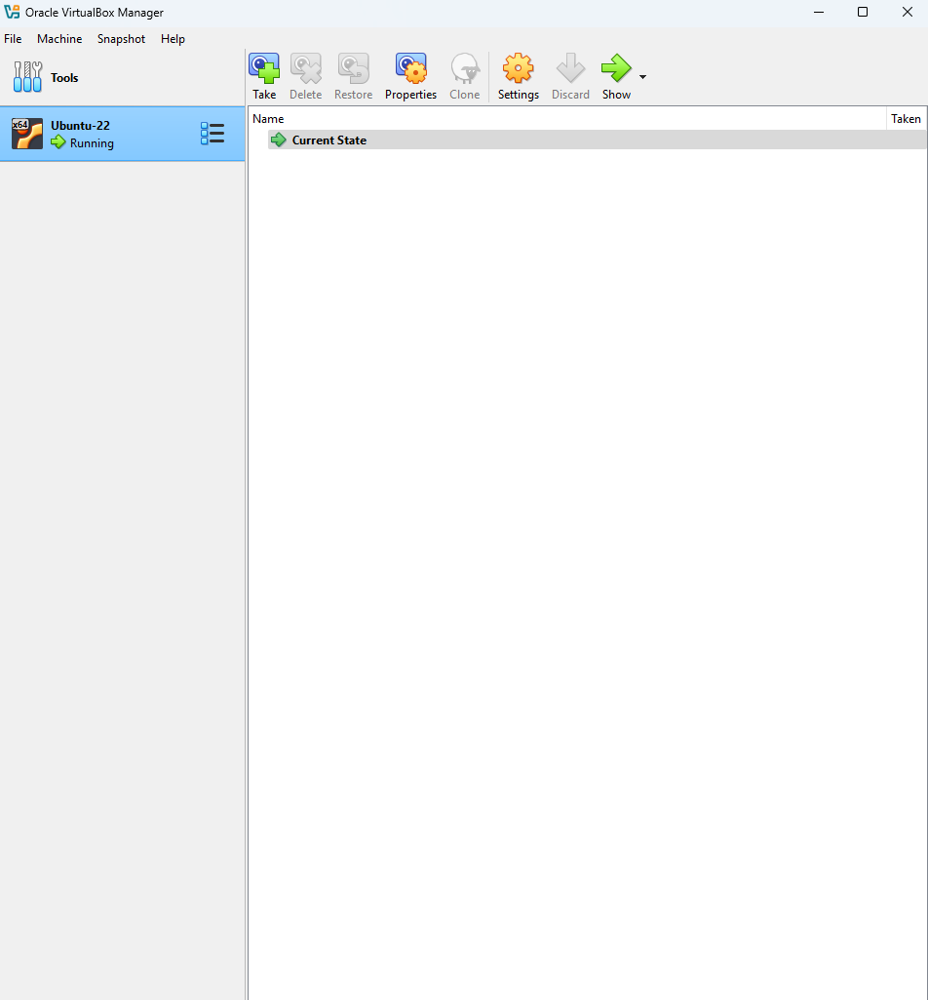
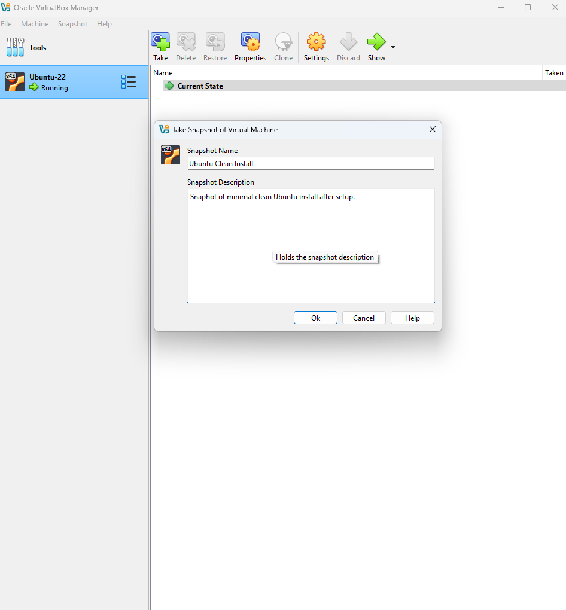
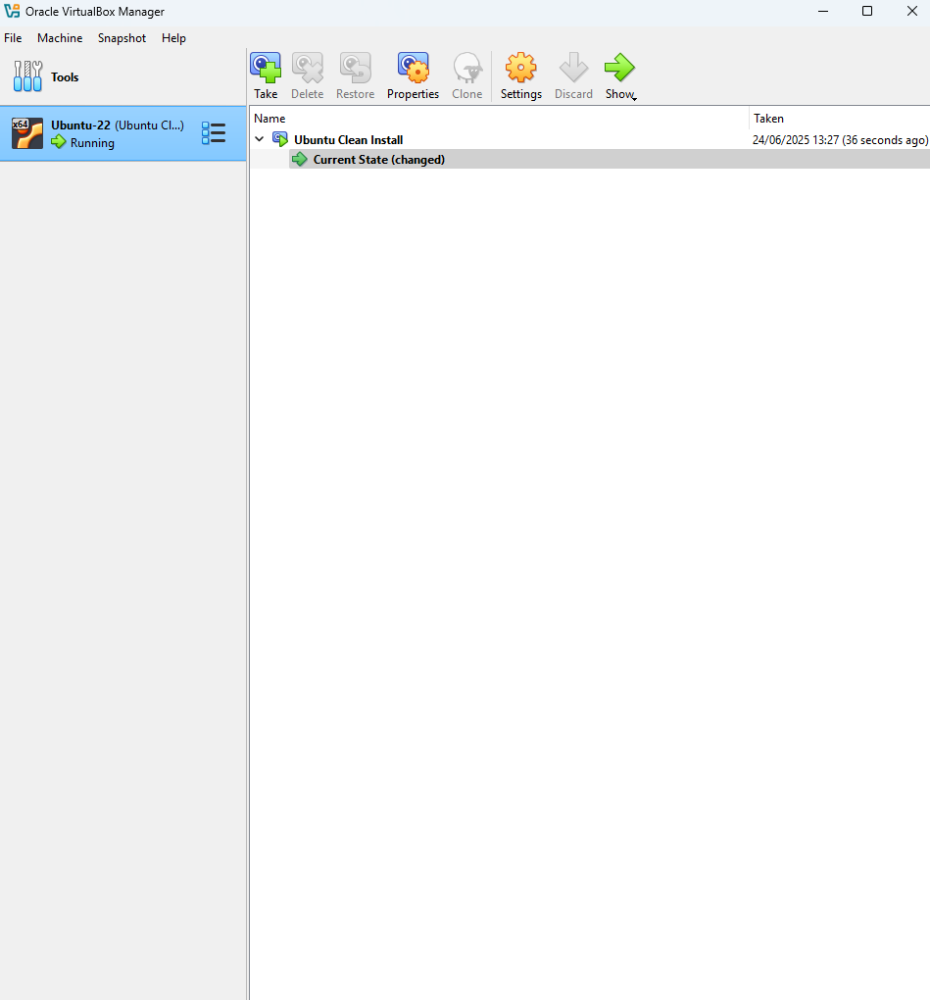

# VirtualBox Troubleshooting & Documentation Project

## Project Goal
To demonstrate the setup, configuration, and troubleshooting of VirtualBox for virtual machine deployment and IT support scenarios. This showcases my ability to work with hypervisors and solve real world technical issues — key skills for IT support and cloud-related roles.

---

## Table of Contents

1. [Download and Install VirtualBox](#step-1-download-and-install-virtualbox)
2. [Create Virtual Machine](#step-2-create-virtual-machine)
3. [Attach Ubuntu ISO](#step-3-attach-ubuntu-iso)
4. [Ubuntu Installation & Troubleshooting](#step-4-ubuntu-installation--troubleshooting)
5. [Create Snapshot](#step-5-create-snapshot)
6. [Troubleshooting Logs](#troubleshooting-logs)

---

## Lab Notes

- [Simulated Network Adapter Failure – Ubuntu VM](notes/network-error.md)

---

## Step 1: Download and Install VirtualBox

- Visited [virtualbox.org](https://www.virtualbox.org)
- Downloaded the Windows installer (version 7.1.6)
- Started the installation with default settings

---

## Step 2: Create Virtual Machine

- [Step 2: Create Virtual Machine](notes/vm-setup.md)

---

## Step 3: Attach Ubuntu ISO

- Opened VirtualBox VM settings → Storage
- Attached `ubuntu-22.04.iso` to the virtual optical drive on SATA Port 1
- Ensured ISO is correctly selected to boot from during VM startup

---

## Step 4: Ubuntu Installation & Troubleshooting

- [Step 4: Ubuntu Installation & Troubleshooting](notes/ubuntu-setup.md)

---

## Step 5: Create Snapshot

### Goal
To save the current clean state of the system, enabling a safe rollback if issues arise during later installations or testing.

### Screenshots
| Before Snapshot | Snapshot Dialog | Snapshot Created |
|------------------|------------------|------------------|
|  |  |  |

### Notes
- Snapshot Name: `Ubuntu Clean Install`
- Description: Snapshot of freshly installed Ubuntu with all initial config complete.
- Why: Acts as a safety net before networking and testing.

---

## Troubleshooting Logs

- [Network Adapter Fix – Ubuntu VM](notes/network-error.md)
