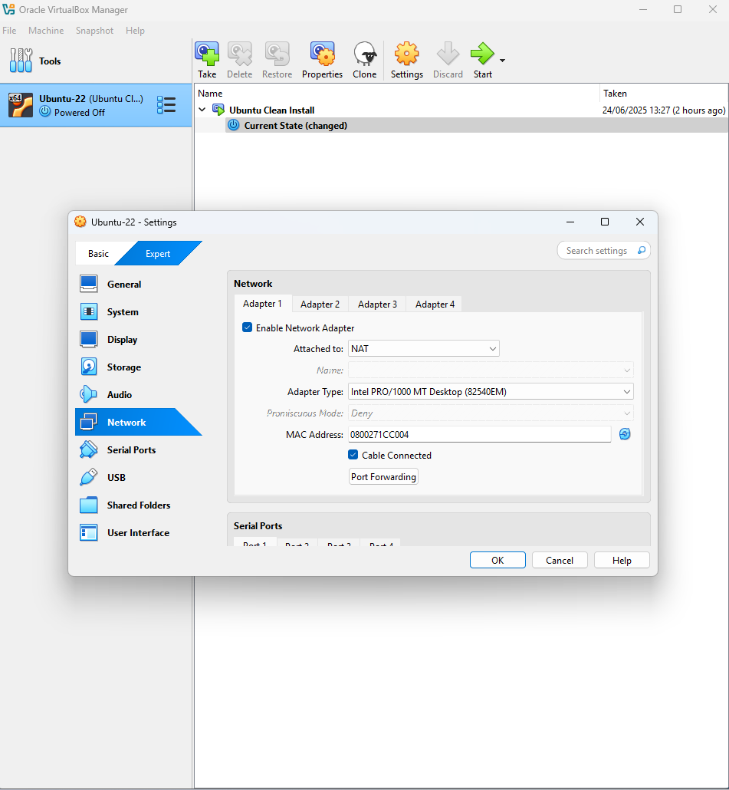
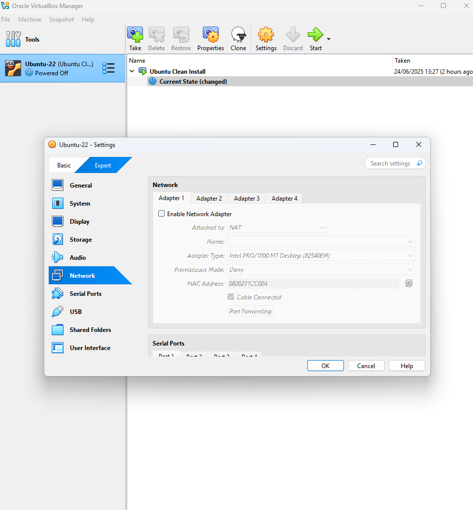
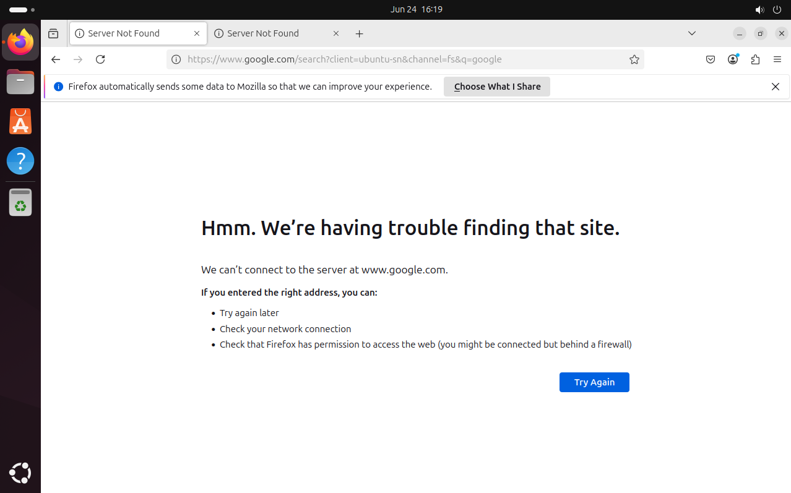
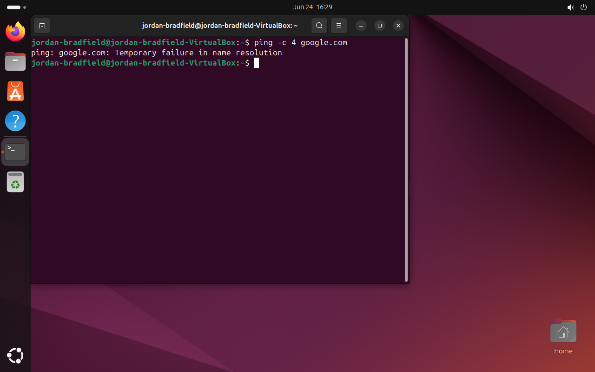
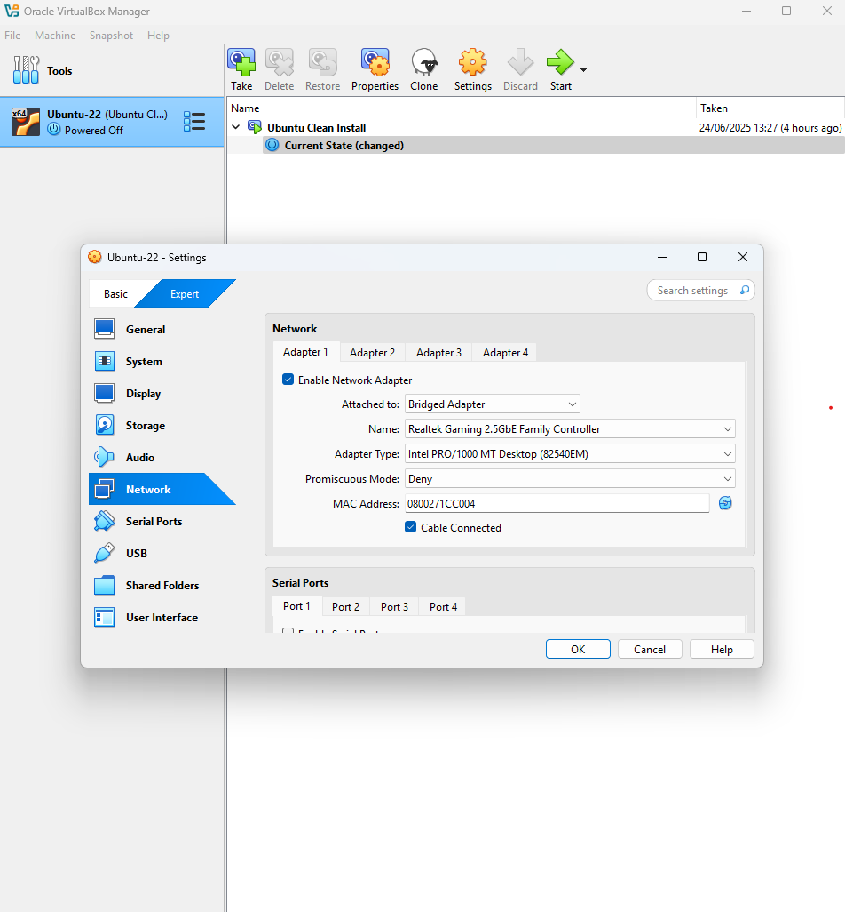
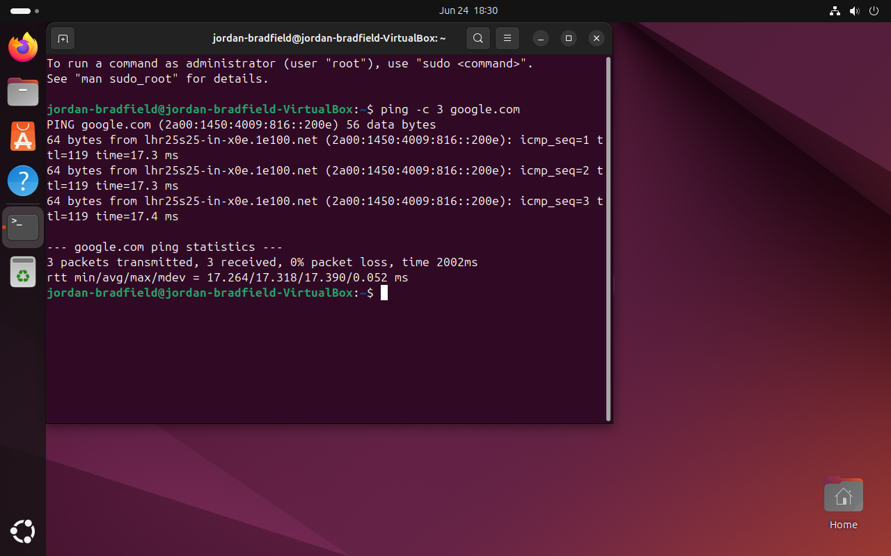

## ✅ 1. Document Current Adapter State (Before Boot)

Captured the enabled state of the network adapter in VirtualBox **before booting Ubuntu**.

📷 Screenshot:  


---

## ❌ 2. Disable the Network Adapter

Simulated a network connectivity failure by disabling the adapter via VirtualBox settings.

**Steps:**

1. Shut down the Ubuntu VM.
2. In VirtualBox:
   - Open *Settings* for the VM.
   - Go to the **Network** tab.
   - Uncheck **"Enable Network Adapter"**.
3. Boot the VM again with networking disabled.

📷 Screenshot:  


---

## ⚠️ 3. Observe Network Failure Inside Ubuntu

Once booted into Ubuntu:

- A system error notification appeared, indicating a network issue.
- The network status icon showed no connectivity.

📷 Screenshot:  


---

### 🔍 Terminal Test

```bash
ping -c 4 google.com
```

**Output:**

```text
ping: google.com: Temporary failure in name resolution
```

📷 Screenshot:  


---

## ✅ Outcome

- Successfully simulated a network failure by disabling the virtual adapter.
- Ubuntu clearly reported a lack of connectivity.
- This test confirmed system-level error notifications and command-line failures.
- Useful for practicing diagnostics and support workflows.


---

## ✅ Step 7: Troubleshooting Network Connection

- Opened **VirtualBox → VM Settings → Network**
- Verified that **Adapter 1** is:
  - Enabled ✅
  - Set to **Bridged Adapter**
  - Attached to host interface (e.g., Wi-Fi)
- Saved changes and restarted VM

📷 Screenshot:  


---

### ✅ Verified Internet Connectivity

- Booted Ubuntu and opened terminal
- Ran: `ping -c 3 google.com`
- Confirmed successful replies from Google (internet is working)

📷 Screenshot:  



