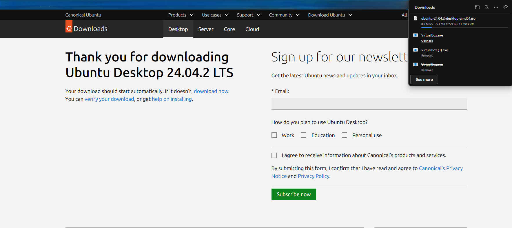

# Ubuntu Guest OS Setup in VirtualBox

## 📌 Objective
To install and configure Ubuntu Desktop as a guest OS inside VirtualBox and troubleshoot any issues that arise.

---

## 🔧 Step-by-Step Setup

### 🐧 Step 1: Download Ubuntu ISO
- Visited [ubuntu.com](https://ubuntu.com/download/desktop)
- Downloaded Ubuntu Desktop **22.04.4 LTS**
- Saved the ISO file to: `~/Downloads/ubuntu-22.04.4-desktop-amd64.iso`

