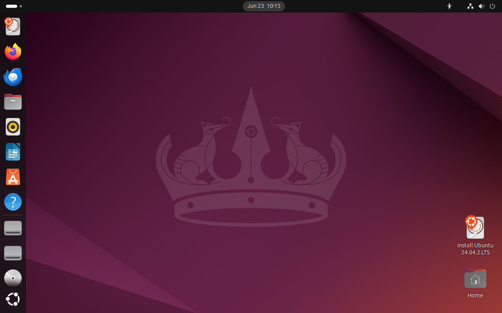

## 🖥️ Step 2: Create New VM

- Opened VirtualBox and clicked **New**
- **Name**: `Ubuntu-22`
- **Type**: `Linux`
- **Version**: `Ubuntu (64-bit)`
- **RAM**: `4096 MB`
- **Virtual hard disk**: VDI, Dynamically allocated, 25 GB

  
  

---

## 💿 Step 3: Attach Ubuntu ISO

- Opened **VirtualBox > Settings > Storage**
- Selected the empty optical drive under the **SATA Controller**
- Clicked the disc icon and chose **"Choose a disk file..."**
- Navigated to the downloaded Ubuntu ISO (`~/Downloads/ubuntu-22.04.iso`)
- Attached the ISO to the optical drive for booting

**Notes:**

- Confirmed the optical drive is higher in boot order than the hard disk (**System → Boot Order**)
- Verified the ISO file version and integrity (not corrupted)

---

## 🧪 Step 4: Start VM & Install Ubuntu

### 🔧 Actions Taken

- Started the VM in VirtualBox
- Followed the Ubuntu installation wizard
- Selected **English** language and keyboard layout
- Chose **Minimal Installation** option
- Opted to install **updates** and **third-party drivers**
- Completed installation and rebooted into the fully installed **Ubuntu desktop**

### 🖼️ Screenshot

