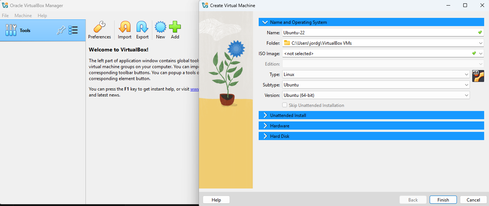
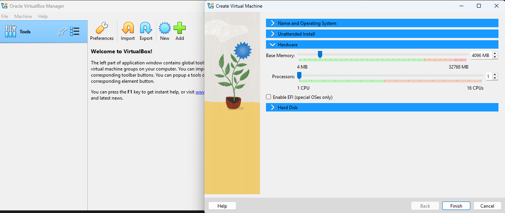
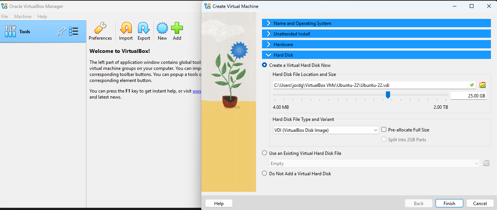
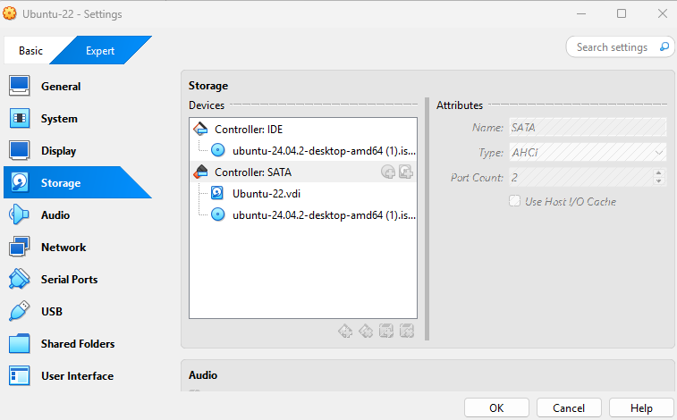

## 🖥️ Step 2: Create New VM

- Opened VirtualBox and clicked "New"
- Name: Ubuntu-22
- Type: Linux
- Version: Ubuntu (64-bit)
- RAM: 4096 MB
- Virtual hard disk: VDI, Dynamically allocated, 25 GB

---

## 💿 Step 3: Attach Ubuntu ISO

- Opened VirtualBox > Settings > Storage
- Selected the empty optical drive under SATA controller
- Clicked the disc icon and chose "Choose a disk file..."
- Navigated to the downloaded Ubuntu ISO (`~/Downloads/ubuntu-22.04.iso`)
- Attached the ISO to the optical drive for booting

**Notes:**

- Confirmed the optical drive is higher in boot order than the hard disk (under System → Boot Order)
- Ensured the ISO file was the correct version and not corrupted
